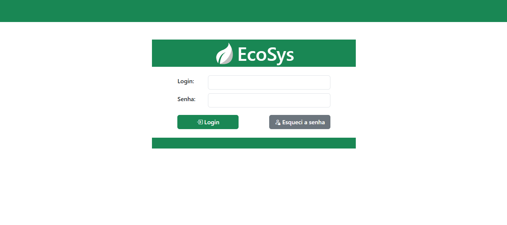

# EcoSys: Sistema para Automação e Otimização da Gestão de Papelarias
Este repositório contém o sistema EcoSys, desenvolvido na forma de TCC para a Pós-Graduação em Desenvolvimento *Full-stack*.

---

## Estruturação das pastas:

```shell
$ tree
  .
  ├── db_popular
  ├── Documentacao
  ├── ecosys-back
  └── ecosys-front
```
onde,
- **ecosys-front**: Contém o *front-end* do sistema, desenvolvido em Angular em conjunto com Bootstrap;
- **ecosys-back**: Contém o *back-end* do sistema, desenvolvido em Node JS;
- **Documentacao**: Possui diagramas desenvolvidos, bem o *mockup* do sistema, desenvolvido no Balsamiq;
- **db_popular**: Complementação para popular o banco de dados com registros fictícios;

---

## Orientações para execução
### Requisitos:
- [Node versão 16.20.2](https://nodejs.org/pt/download);
- [Angular versão 16](https://v16.angular.io/guide/setup-local);
- [Postgres](https://www.postgresql.org/download/windows/);
- [Postman](https://www.postman.com/);
- [Python](https://www.python.org/downloads/windows/).

### Passo a passo
1. Baixar e instalar o Postgres;
    1. Criar o usuário de login "*node_user*" e senha "*node_password*" com permissão total.
2. Baixar e instalar o Node, versão 16.20.2;
3. Instalar o Angular via npm, com o comando ***npm install -g @angular/cli@16***;
4. Baixar e instalar o Postman;
5. Baixar e instalar o Python;
6. Na pasta *db_popular*, rodar o comando ***python gerar_dados.py*** para gerar dados para o DB;
7. Na pasta *ecosys-back*, instalar dependencias com o comando ***npm install***;
8. Em seguida, no mesmo diretório, instalar o dump gerado pelo Python através do comando ***npm run configure***;
9. Neste momento, o *backend* está pronto para ser servido através do comando ***npm run dev***;
10. Na pasta *ecosys-front*, instalar dependencias do Angular com o comando ***npm install***;
11. Servir o *front-end* através do comando ***ng serve***;
12. No Postman, criar o primeiro usuário através do comando POST na rota ***localhost:3000/conta/cadastrarPrimeiro*** com o seguinte elemento no *body*:
```js
{
    "login": "login",
    "categoria": "g",
    "login": "login",
}
```
13. O *backend* retornará o objeto:
```js
{
    "status": "ok"
}
```
14. Acessar o sistema no navegador através do link ***http://localhost:4200/login***



